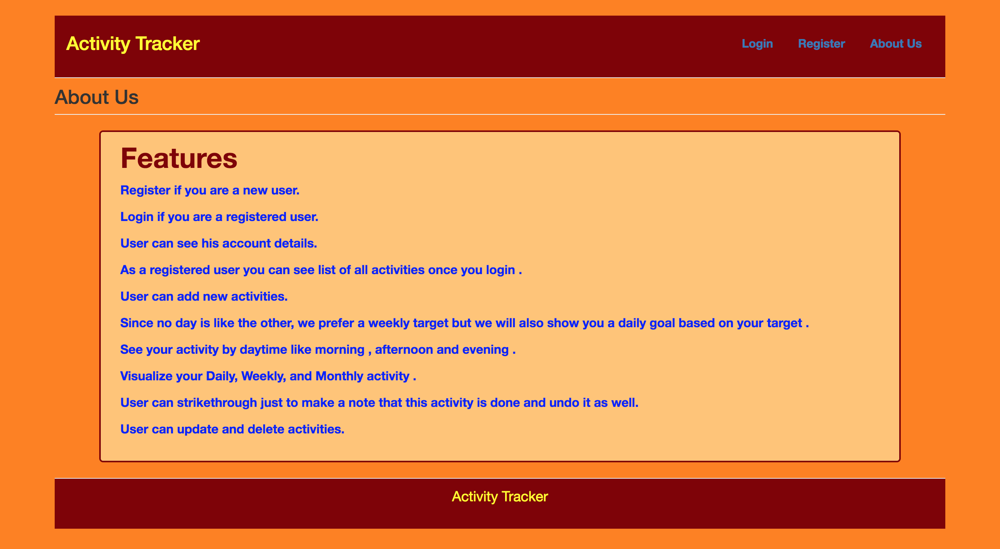
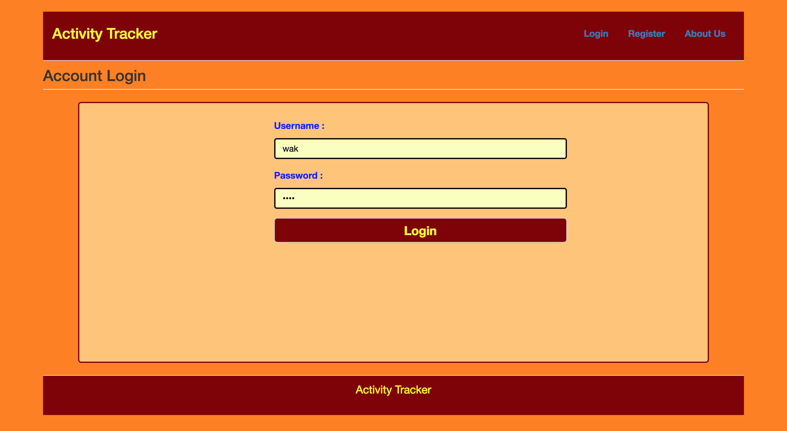
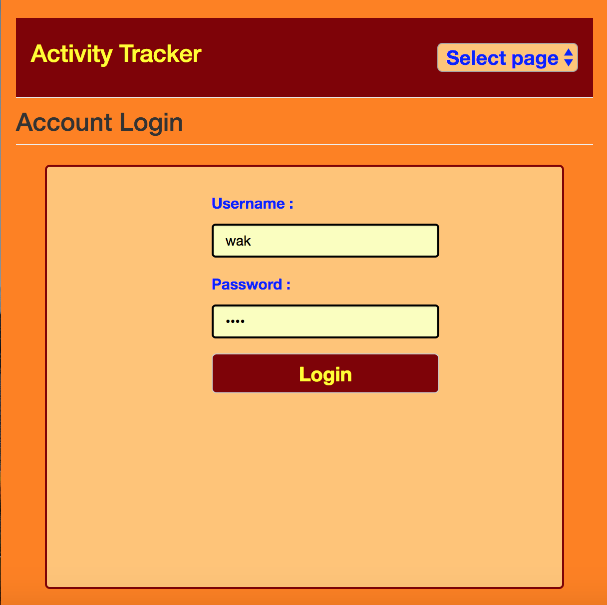
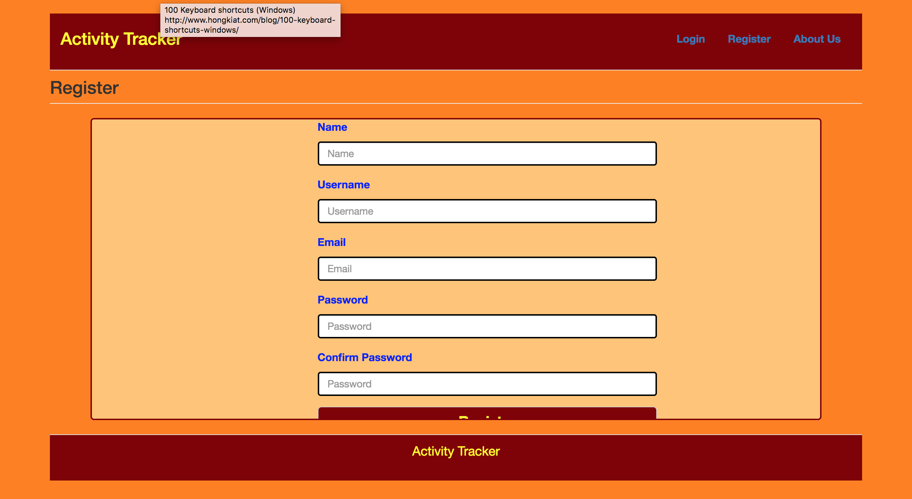
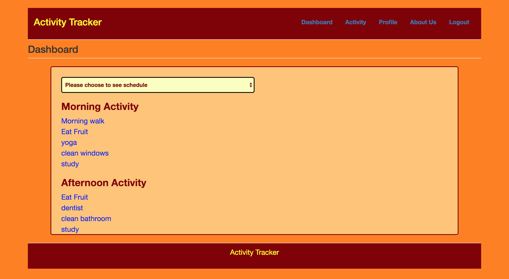
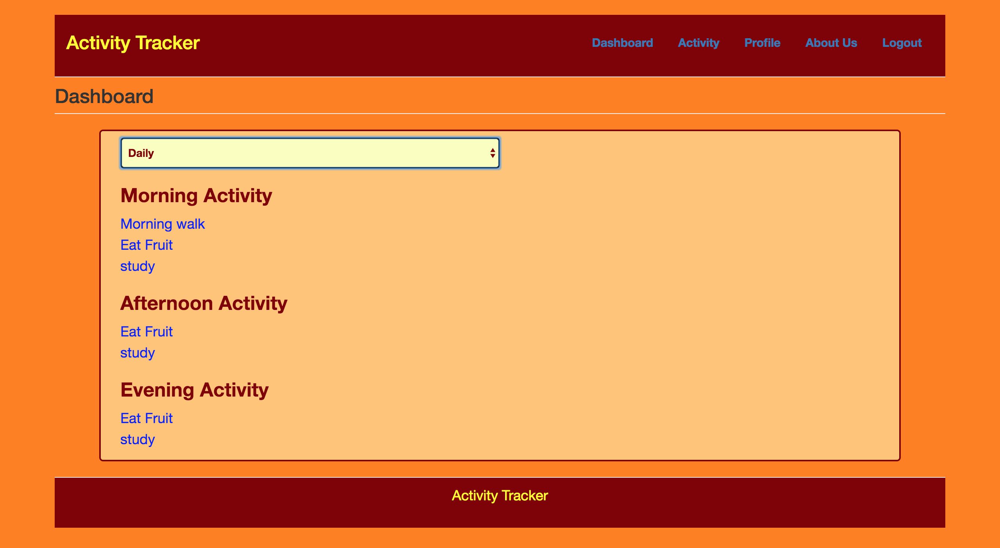
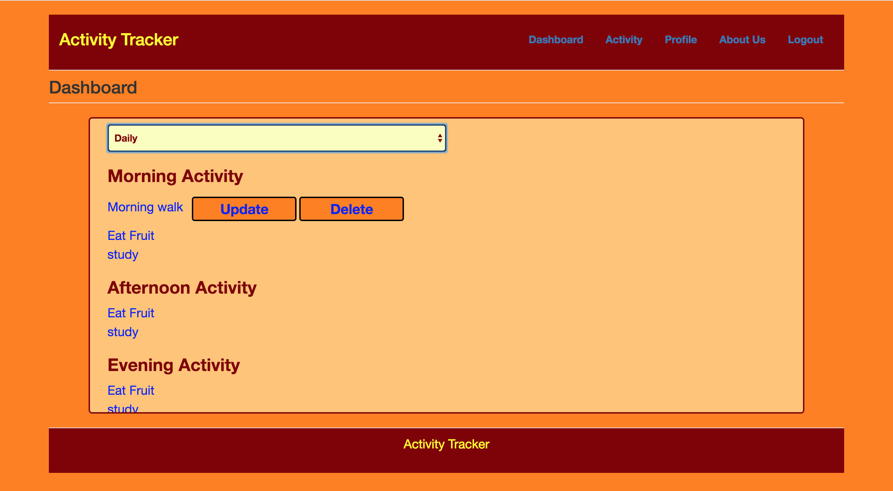
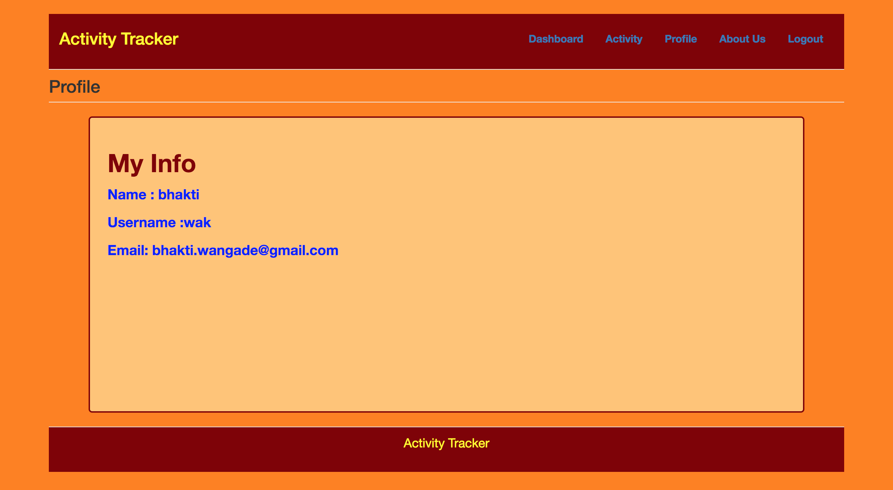

# Activity Tracker App

### Built by Bhakti Wakchaure 

## About Activity Tracker 
Activity Tracker  is an app  which helps to track of  users daily ,weekly and monthly activities . User can also add new activity  and update  or delete activities if he/she wants to . As a new user , user can  register  and then login to the application and take advantage of the features available .
How to use Activity Tracker App 
As a non-registered user you can see about us page .For registration  , click on registration page and register using simple form .registered user can login .

After login , user will see his/her complete activities categorized as a morning ,afternoon and evening activities .
If user wants to see only Daily , weekly or Monthly activities ,then select Daily , weekly or Monthly from dropdown and then activities will display accordingly .
If you wants to update or delete particular  activity , hover over it and click on update or delete button .
User can strikethrough if the activity is done for the day. 
If user wants to create new activity , click on activity tab .
User can view his profile ,by clicking on profile tab .
About us will display a page with features of app.
Once you are done ,you can logout.

## The code
Frontend: Handlebars, JQuery
Style : CSS
Backend: Node.js with Express
Database: Mlab 

## Getting started

## Setting up a project

Move into your projects directory: cd ~/YOUR_PROJECTS_DIRECTORY
Clone this repository: git clone https://github.com/oampo/thinkful-full-stack-template YOUR_PROJECT_NAME
Move into the project directory: cd YOUR_PROJECT_NAME
Install the dependencies: npm install
Working on the project
Move into the project directory: cd ~/YOUR_PROJECTS_DIRECTORY/YOUR_PROJECT_NAME
Run the development task: node app
Starts a server running at http://localhost:3000

## Project Link 
 http://safe-cove-28965.herokuapp.com/
 
## Directory layout

├── client      Client-side code
│   ├── public  Images, videos, etc.
│   ├── js      JavaScript
│   ├── css    CSS stylesheets
|   ├──handlebars  html pages 
|   
├── server      Server-side code
└── test        Tests
    ├── client  Client tests
    └── server  Server tests

## Images 

